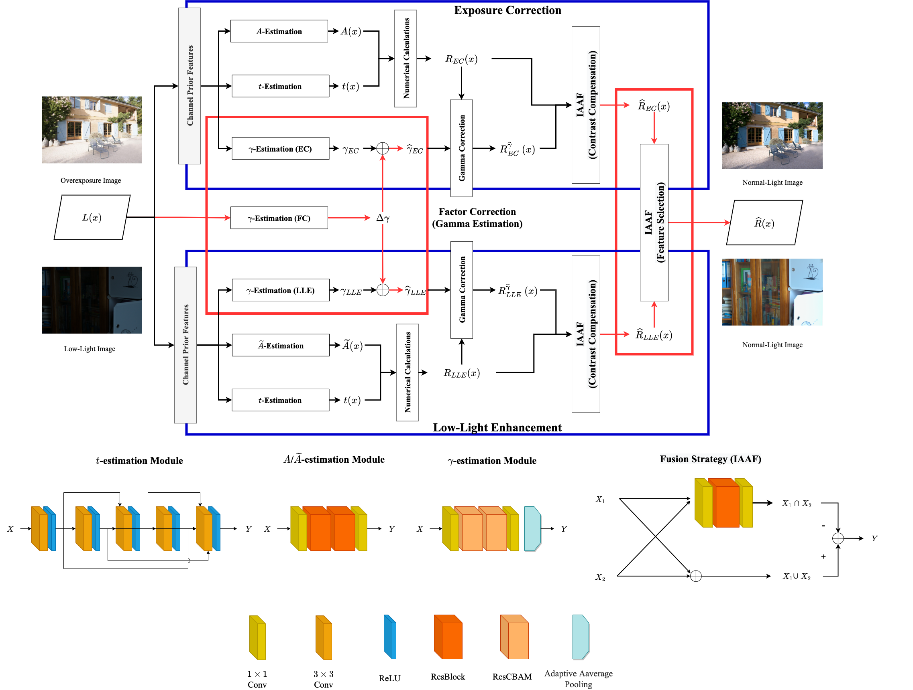
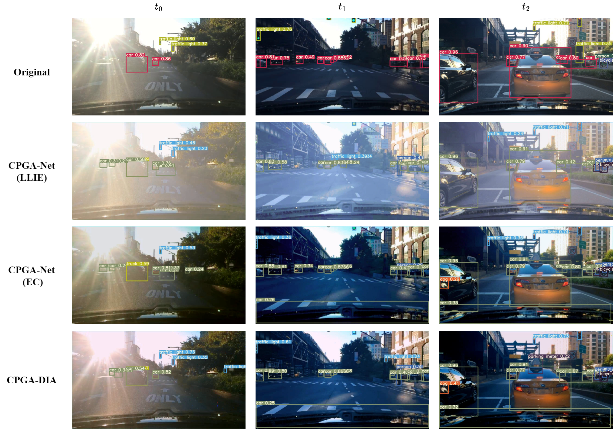
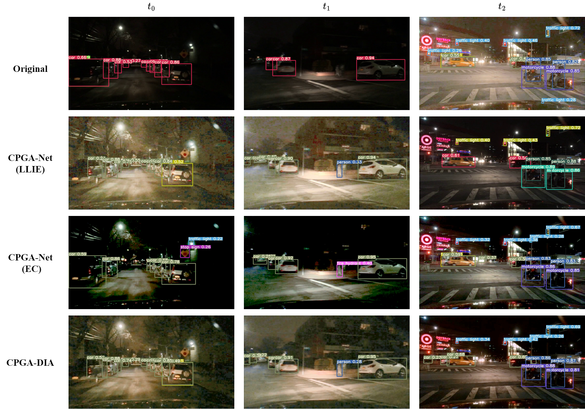

# [From dim to glow: dynamic illuminance adjustment for simultaneous exposure correction and low-light image enhancement](https://doi.org/10.1007/s11760-024-03519-0)

Official CPGA-DIA implemenation based on Pytorch

## CPGA-DIA



## Demo

### Demo CPGA-DIA (Image)

```
python demo_enhance_CPGADN.py --net_name CPGA_DIA-lolv1 --use_gpu true --gpu 0 --val_ori_data_path LOLdataset/eval/eval15/low/ --val_haze_data_path LOLdataset/eval/eval15/low/ --dataset_type LOL-v1 --num_workers 1 --val_batch_size 1 --ckpt CPGA_DIA.pkl
// val_haze_data_path & val_ori_data_path keep the same input and use dataset_type LOL-v1
```

### Demo CPGA-DIA (Video)

```
python demo_enhanced_video_CPGADN.py --use_gpu true --gpu 0 --output_name test --video_dir YOUR_VIDEO.mov --num_workers 0 --val_batch_size 1 --ckpt CPGA_DIA.pkl
```




## Citation
```
Weng, SE., Hsu, CP., Hsiao, CY. et al. From dim to glow: dynamic illuminance adjustment for simultaneous exposure correction and low-light image enhancement. SIViP (2024). https://doi.org/10.1007/s11760-024-03519-0
```

### Keywords
```
Dynamic illuminance adjustment  
Low-light image enhancement  
Exposure correction  
Multi-task learning  
Advanced driver assistance systems
``` 


## Acknowledgement
[CPGA-Net](https://github.com/Shyandram/CPGA-Net-Pytorch)